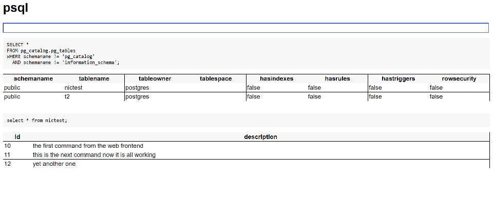

# A PSQL webapp

This is an Express app that will allow implement a PSQL like query
tool in your browser.

It looks like this:




## Install

Just:

```
npm install psqlapp
```


## How to use it

In your Express app, you need something like:

```javascript
const express = require("express");
const psqlWebApp = require("psqlapp");
const { Pool } = require('pg');

const pool = new Pool(databaseConfig); // your own db connection details
const app = express();

app.query = function (sql, parameters) {
   let client = await pool.connect();
   let result = await client.query(sql, parameters);
   return result;
};

psqlWebApp.init(app);

```

in other words you need to implement a `query` function which will
return a result-set; the function needs to be added to the `app`
object which `psqlWebApp.init` receives.

See [here](https://node-postgres.com/features/connecting) for details
on the `databaseConfig` for the `pg` library.

## Options

You can also pass in a middleware function to be added to all the
routes handlers for the PSQL web app so that you can use
authentication or such like.

Like so:

```javascript
psqlWebApp.init(app, {
  middleware: function (request, response, next) {
     console.log("logging path middleware", request.path);
     next();
  }
});
```

The middleware functions must be valid Express middleware.

If you want a list of middleware you'll need to implement that
yourself, within a single middleware.

